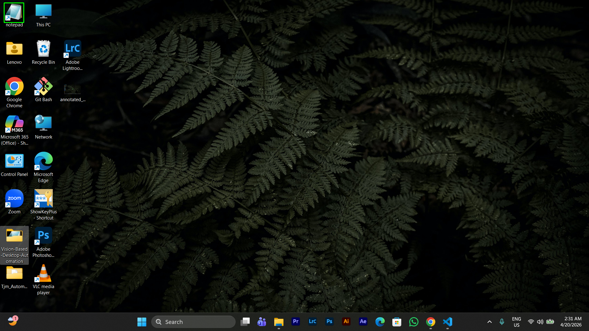
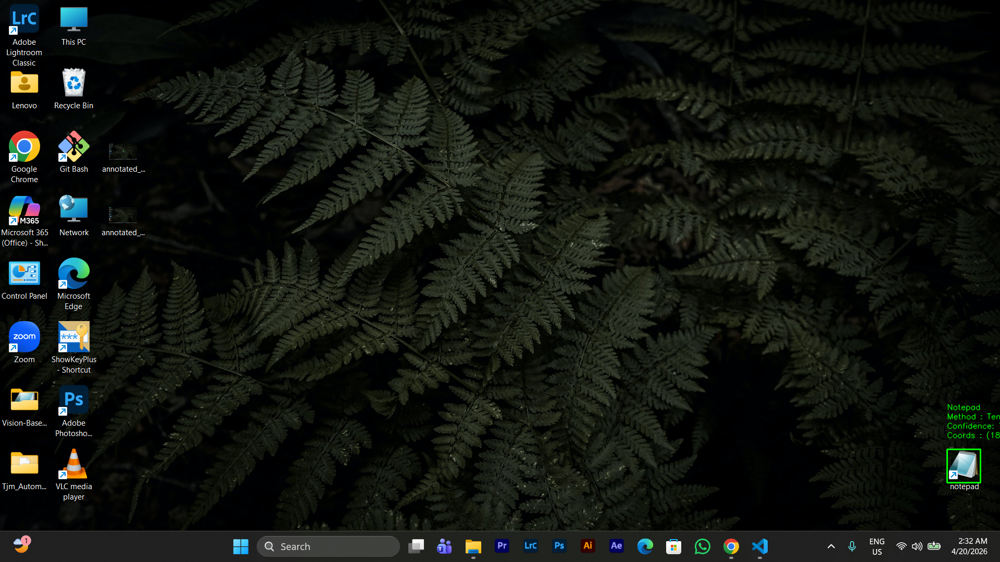
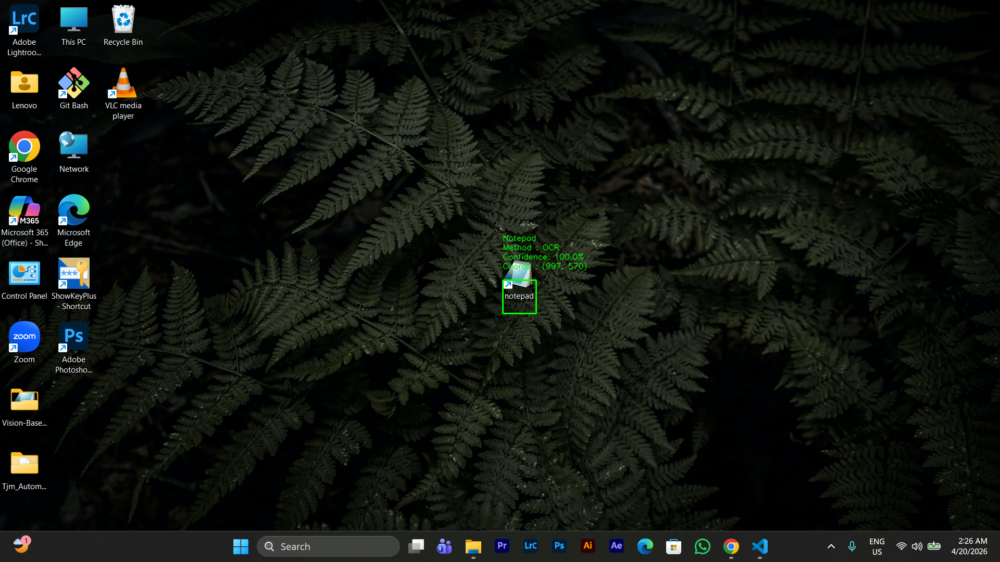

# TJM Automation

A Windows desktop automation tool that finds the Notepad icon on the desktop using computer vision, opens it, and saves 10 blog posts as individual text files — all without any human interaction.

---

## What It Does

1. Presses **Win + D** to show the desktop
2. Locates the Notepad icon using template matching (BotCity) or OCR fallback
3. Double-clicks it to open Notepad
4. Fetches 10 posts from [JSONPlaceholder](https://jsonplaceholder.typicode.com/posts)
5. For each post: types the content, saves it to `~/Desktop/tjm-project/post_{id}.txt`, closes Notepad
6. Saves an annotated screenshot every time the icon is detected

---

## Prerequisites

- Windows 10 or 11
- A **Notepad shortcut visible on the desktop**
- Python 3.11+
- [uv](https://docs.astral.sh/uv/) — install with `pip install uv`

---

## Installation

```bash
uv sync
```

---

## Running

```bash
uv run python main.py
```

Press **ESC** at any time to stop cleanly between posts.

---

## How Icon Detection Works

### Step 1 — Template Matching (BotCity)

The bot compares a reference image (`src/resources/notepad_icon.png`) against a live screenshot of the desktop using BotCity's image matching engine. This is fast (under 1 second) and accurate when the icon looks the same as the reference image.

- Configure the confidence threshold in `src/settings.py` → `TEMPLATE_CONFIDENCE_THRESHOLD` (default: `0.7`)
- The reference image path is `src/settings.py` → `REFERENCE_IMAGE_PATH`

### Step 2 — OCR Fallback (EasyOCR)

If no reference image is found, or if template matching returns no result, the bot falls back to OCR. It scans the full desktop screenshot for text that matches "Notepad" and returns the center of the closest match.

- OCR is slower on the **first run** (~18 seconds to load the model), but subsequent calls reuse the cached reader and are much faster.
- Useful when the icon looks different from the reference (e.g. different theme or icon pack).

### Step 3 — ScreenSeekeR (LLM Grounding)

If you'd rather skip the classic vision pipeline altogether, the bot can ask a vision LLM (Gemini) to find the icon for you. This follows the **ScreenSeekeR** approach from the *ScreenSpot-Pro* paper ([Li et al., arXiv:2504.07981](https://arxiv.org/abs/2504.07981)), adapted to our single-icon use case.

It works in two small stages:

1. **Plan** — send the whole desktop screenshot to Gemini and ask *where the Notepad icon is most likely to be*. The model returns up to three candidate regions, in descending order of probability.
2. **Ground** — crop each candidate (most likely first) and ask Gemini for the exact center of the icon inside that crop. The first crop that returns a point wins, and the coordinate is mapped back to full-screen pixels.

The "look broadly, then zoom in" pattern is what makes ScreenSeekeR more reliable than asking a model to point at a tiny icon on a full-screen image in one shot.

Turn it on by setting `USE_LLM_GROUNDING=true` in `.env`. When the flag is on, the bot uses **only** Gemini — template matching and OCR are skipped. When it's off (the default), the LLM is never called.

```env
USE_LLM_GROUNDING=true
GEMINI_API_KEY=your-key-here
GEMINI_MODEL=gemini-2.5-flash
```

The code lives in `src/screenseeker.py` and is built on the `google-genai` SDK.

---

## Coordinate Caching

After successfully opening Notepad for the first time, the bot stores the icon's `(x, y)` coordinates in memory. For every subsequent post, it tries those cached coordinates first — double-clicking them and immediately checking if Notepad opened.

- **Cache hit**: Notepad opens → skip grounding entirely, saves time.
- **Cache miss**: Notepad does not open within the verify pause → discard cache, run full grounding again, update cache with the new coordinates.

This means grounding only runs when needed, not for every single post.

---

## Annotated Screenshots

Every time the bot locates the Notepad icon (via template or OCR), it saves an annotated screenshot to `screenshots/` before clicking.

Each screenshot shows:

- A **green rectangle** around the detected icon
- The detection **method** (Template or OCR)
- The **confidence score** as a percentage
- The **pixel coordinates** of the detection

Files are named: `annotated_post1.png`, `annotated_post2.png`, etc.

### Examples

#### Template matching — icon detected top-left of screen



#### Template matching — icon detected bottom-right of screen



#### OCR fallback — icon detected at center of screen



---

## Output

| Location | Contents |
| --- | --- |
| `~/Desktop/tjm-project/` | `post_1.txt` through `post_10.txt` |
| `screenshots/` | `annotated_post1.png` through `annotated_post10.png` |

Each text file contains:

```text
Title: <post title>

<post body>
```

---

## Configuration

All tunable values live in `src/settings.py`. Key ones:

| Setting | Default | Description |
| --- | --- | --- |
| `REFERENCE_IMAGE_PATH` | `src/resources/notepad_icon.png` | Reference image for template matching |
| `TEMPLATE_CONFIDENCE_THRESHOLD` | `0.7` | Minimum match score for BotCity |
| `OCR_SIMILARITY_THRESHOLD` | `0.6` | Minimum text similarity for OCR |
| `USE_LLM_GROUNDING` | `false` | When `true`, use only ScreenSeekeR (Gemini); skip template and OCR |
| `SCREENSEEKER_MAX_CANDIDATES` | `3` | Max candidate regions the planner returns |
| `SCREENSEEKER_CROP_PADDING` | `20` | Pixels of padding added around each candidate crop |
| `MAX_GROUNDING_RETRIES` | `3` | How many times to retry finding the icon |
| `OPEN_TIMEOUT_SECONDS` | `10` | How long to wait for Notepad to open |
| `CACHE_VERIFY_PAUSE` | `1.0` | Seconds to wait after clicking cached coords |
| `BETWEEN_POST_PAUSE` | `1.5` | Pause between posts |
| `OUTPUT_DIR` | `~/Desktop/tjm-project` | Where post files are saved |

---

## Project Structure

```text
Tjm_Automation/
├── main.py                    # Entry point
├── pyproject.toml             # Dependencies and scripts
├── screenshots/               # Annotated detection screenshots (auto-created)
└── src/
    ├── settings.py            # All configuration constants
    ├── grounder.py            # Icon detection: BotCity template match → OCR fallback
    ├── screenseeker.py        # ScreenSeekeR LLM grounding (Gemini); used when USE_LLM_GROUNDING=true
    ├── notepad.py             # Open, type, save, close Notepad
    ├── workflow.py            # Main loop: 10-post orchestration
    ├── api_client.py          # Fetch posts from JSONPlaceholder
    ├── utils.py               # Screenshot capture and annotation
    └── resources/
        └── notepad_icon.png   # Reference image for template matching
```

---

## Known Limitations

| Scenario | Behaviour |
| --- | --- |
| No reference image | Falls back to OCR automatically |
| OCR first run | ~18 s model load; subsequent calls are fast |
| Icon not found after 3 retries | Raises an error and stops |
| Different icon theme or DPI | Replace `notepad_icon.png` with a fresh screenshot crop |
| Win 11 "new" Notepad | Save-As dialog path may differ from classic Notepad |
